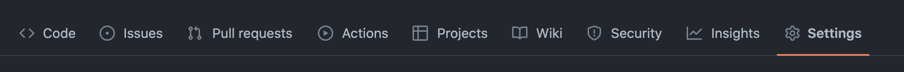
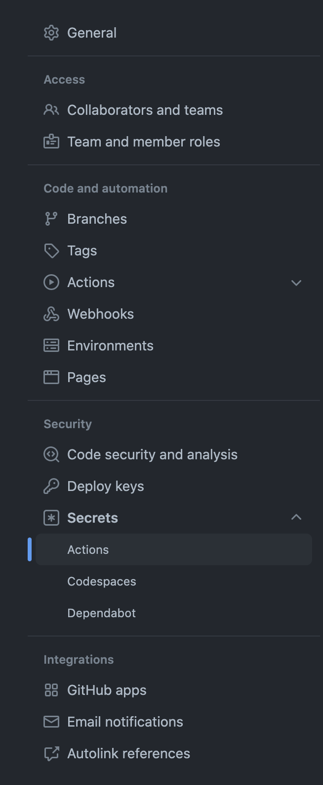
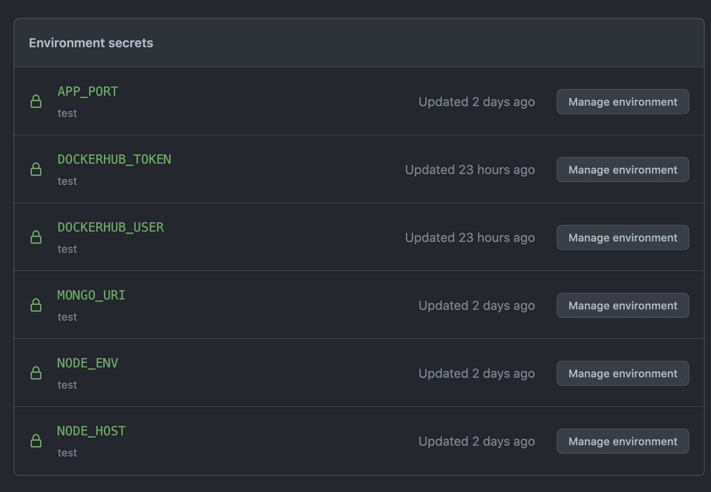
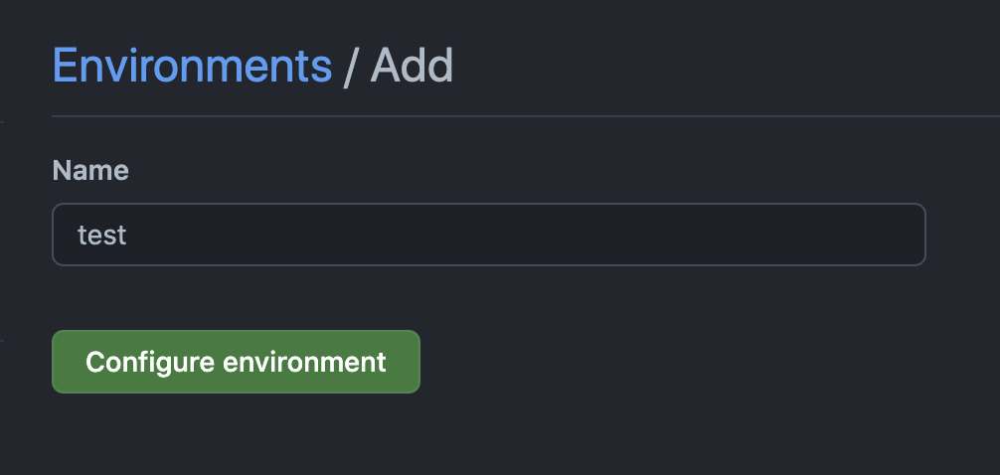
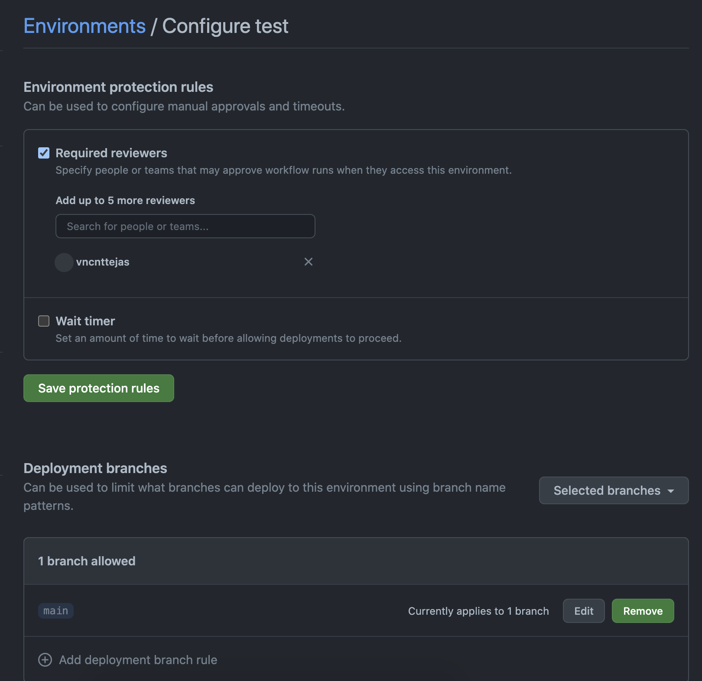

# Farm App

A simple app to store details of animals in our farm

## Pre-requisites

### Node
Ensure the right version of Node is installed on your machine.
In order to ensure you're using the correct version of node, it is useful to have [nvm](https://github.com/nvm-sh/nvm#installing-and-updating). If you have nvm, you can run it at the root of the repo to switch to the correct node version based off the .nvmrc.

```bash
nvm use
```

Otherwise you will need to ensure you're running the version of node outlined in .nvmrc

### Docker
Docker is used to run this project. To run services locally, you need **docker** and **docker-compose** installed on your machine.

## Getting Started

This section helps setting up the app locally and gives high level understanding of the repo structure.

### Initial Setup
- Make sure the pre-requisites are met 
- Run the `docker-compose up -d` command to start the `mongodb` app
- Copy the `.env.example` file and create a new file called `.env` from it and save it in the repo root
- Update the `.env` file with appropriate values
  - `NODE_ENV` - Node environment
  - `NODE_HOST` - Node app host url
  - `APP_PORT` - Port on which the app will be run
  - `MONGO_URI` - Mongodb uri, including the username and password

### Installation and Running the App
- The app is written in Node.JS and uses the Fastify package for the webserver
- To install the dependencies you can use `npm` or `yarn` or other node installers
- Run the following command the repo root, to install the dependencies
  ```bash
  npm install
  ```
- To run the app on your machine use the command
  ```bash
  npm start
  ```

### Unit Tests
- The unit tests are written with `jest` unit test framework
- This package is installed during the dependencies are installed during [Installation and Running the App](#installation-and-running-the-app) phase
- To run the unit tests along with the coverage run:
  ```bash
  npm t
  ```
- The tests are stored in the tests folder in the repo root
- The test coverage is displayed to you after the test completes running
- The test coverage is also stored in a untracked folder [coverage](./coverage/), which will be created only after the tests are run
- The test configurations are stored in the [jest.config.js](./jest.config.js) file, which requires the coverage to hit a min limit for the CI/CD pipelines to pass
- [jest.config.js](./jest.config.js) file can be modified as per requirement

### Code Style and Linting
- The repo uses `eslint` as the lint tool and `prettier` for enforcing styles
- The eslint airbnb standard is followed
- These config can be found in the [.prettier](./.prettierrc) and [/eslint.json](./.eslintrc.json) files in the repo root

## CI/CD Setup (One time)

### Github Setup
- Since the farm-app repo uses Github Actions for CI/CD, it is recommended to use of Github for this repo
- The github files can be found in the [.github](./github/workflows) folder, Github actions documentation page can help understand these files better.

#### Github Secrets Setup
- Since the CI/CD pipelines expect the secrets to be provided in the worflow files, we need to add these from the github settings page


- Once on the page the required secrets can be added

- We also need to add an environment to handle handling environment specific secrets like database url
- To add an environment navigate to the environment link on the settings page
- Click on the "New Environment" button
- Add "test" environment on this page

- Add required reviewers if required, this helps to pause the deployment to the environment until an approval is provided

- Add environment specific values like
  - `KUBECONFIG` - Can be obtained from [helm-infra](.) deployment output
  - `APP_PORT`
  - `NODE_ENV`

## K8s cluster setup
- There a couple one time tasks that should be performed on the K8s cluster
- These tasks are related to deploying the db and secrets, that do not need frequent updates

### Setting up the database
- Since we're using the mongodb for persisting data, we need to ensure to deploy the db to k8s cluster
- The database can be deployed to the k8s cluster by running the following command
  ```bash
  helm install farm-db \
    --set auth.rootPassword=<rootpass>,auth.username=<username>,auth.password=<password>,auth.database=<auth-db> \
    bitnami/mongodb
  ```
### Setting up the secret
- Since the db connection string should not be easily accessible, it should be deployed as secret
- In order to save the secret to the k8s cluster, save the following yaml snippet as a file and replace the `<mongo-uri>` placeholder with the real value
  ```yaml
  apiVersion: v1
  kind: Secret
  metadata:
      name: farm-app
      namespace: default
  data:
      mongo-uri: <mongo-uri>
  type: Opaque
  ````
- After the file is saved run the manifest with the following command to be applied on the k8s cluster
  ```bash
  kubectl apply -f <secret-file-name>
  ```